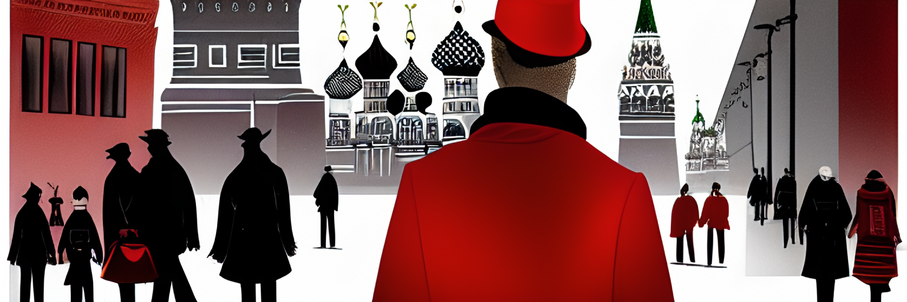
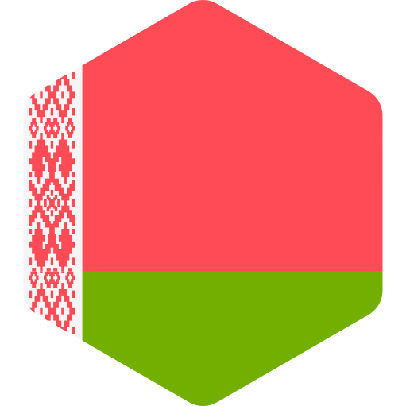
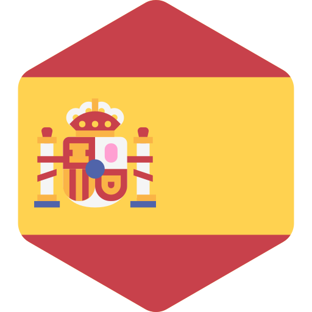

# Woland-10

Parallel corpora of Bulgakov's **The Master and Margarita**.

Image by SD. _view of moscow in fifties, Master and Margarita, professional illustrator, by rutkowski, trending on artstation, man in red coat and black hat goes on the street, mysterious, intricate details._

## About

This repo contains aligned corpus of 10 editions of MaM novel in different languages.

It was created with Lingtrain Alignment Studio which is an open-sourced tool fow aligning parallel texts and creating multilingual books. Feel free to join [our chat in tg](https://t.me/lingtrain_books) and the [Lingtrain project on GitHub]().

## Languages

There are 10 languages by now.

- Russian
- Belarusian
- Ukrainian
- English
- German
- French
- Italian
- Spanish
- Hungarian
- Chinese

## Examples

|  | Вино какой страны предпочитаете в это время дня?                 |
| ----------------------------------------- | :--------------------------------------------------------------- |
|  | Вiно з якое краiны вы любiце ў гэтую пару дня?                   |
|  | Вино якої країни вам більше до вподоби цієї пори дня?            |
|  | What country's wine do you prefer at this time of day?'          |
|  | Den Wein welches Landes bevorzugen Sie zu dieser Tageszeit?"     |
|  | Du vin de quel pays préférez-vous, à cette heure de la journée ? |
|  | Il vino di quale paese preferisce a quest'ora del giorno?        |
|  | ¿De qué país lo prefiere a esta hora del día?                    |
|  | Milyen bort szeret a legjobban ilyenkor déltájban?               |
|  | 平常在这个时间您喜欢喝哪国产的葡萄酒？                           |

|  | – Простите, не поверю, – ответил Воланд, – этого быть не может. Рукописи не горят.                                |
| ----------------------------------------- | :---------------------------------------------------------------------------------------------------------------- |
|  | – Даруйце, не веру, – адказаў Воланд, – гэтага не можа быць. Рукапiсы не гараць.                                  |
|  | – Даруйте, не повірю, – відповів Волянд, – такого бути не може. Рукописи не горять.                               |
|  | 'Forgive me, but I don't believe you,' Woland replied, 'that cannot be: manuscripts don't burn.                   |
|  | "Verzeiht, das glaube ich nicht", entgegnete Voland, "das kann nicht sein, denn Manuskripte brennen nicht."       |
|  | – Excusez-moi, mais je ne puis vous croire, répliqua Woland. Cela ne se peut pas : les manuscrits ne brûlent pas. |
|  | – Scusi, non ci credo, - replicò Woland, - non può essere, i manoscritti non bruciano -.                          |
|  | –Usted perdone, pero no le creo –respondió Voland–, es imposible, los manuscritos no arden                        |
|  | – Már engedje meg, ezt nem hiszem el – mondta Woland. – Ilyesmi nem létezik: kézirat sosem ég el.                 |
|  | "对不起，这我可不信，"沃兰德说，"这不可能。 原稿是烧不毁的。                                                      |

|  &nbsp;&nbsp; | – Мы говорим с тобой на разных языках, как всегда, – отозвался Воланд, – но вещи, о которых мы говорим, от этого не меняются.                          |
| ------------------------------------------------------ | :----------------------------------------------------------------------------------------------------------------------------------------------------- |
|               | – Мы гаворым з табою на розных мовах, як заўсёды, - адазваўся Воланд, але рэчы, пра якiя мы гаворым, ад гэтага не мяняюцца.                            |
|               | – Ми говоримо з тобою різними мовами, як завжди, – озвався Волянд, – та речі, про які ми говоримо, від цього не міняються.                             |
|               | 'You and I speak different languages, as usual,' responded Woland, 'but the things we say don't change for all that.                                   |
|               | "Du und ich, wir sprechen verschiedene Sprachen wie immer", entgegnete Voland, "aber die Dinge, von denen wir sprechen, werden dadurch nicht anders.   |
|               | – Nous parlons, toi et moi, des langues différentes, comme toujours, dit Woland. Mais les choses dont nous parlons n’en sont pas changées pour autant. |
|               | – Parliamo due lingue diverse, come sempre, – replicò Woland, – ma le cose di cui parliamo non cambiano per questo.                                    |
|               | –Como siempre, hablamos en idiomas distintos —respondió Voland—, pero las cosas de que hablamos no cambian por eso.                                    |
|               | – Más-más nyelven beszélünk, mint mindig, de ez mit sem változtat azon, amiről beszélünk - állapította meg Woland.                                     |
|               | "和往常一样，我们两人是在用不同的语言讲话，"沃兰德回答说，"但是，我们所谈的事物本身并不因此而有所改变。                                                |

|  | Поймите, что язык может скрыть истину, а глаза – никогда!                          |
| ----------------------------------------- | :--------------------------------------------------------------------------------- |
|  | Зразумейце, язык можа ўтоiць праўду, а вочы - нiколi!                              |
|  | Утямте, що язик може приховати істину, а очі — ніколи!                             |
|  | Understand that the tongue can conceal the truth, but the eyes - never!            |
|  | Begreift doch, Zungen können die Wahrheit verbergen, aber Augen nie!               |
|  | Comprenez donc que si la langue peut dissimuler la vérité, les yeux – jamais !     |
|  | Capite, la lingua può nascondere la verità, ma gli occhi mai!                      |
|  | Quiero que comprendan que la lengua puede ocultar la verdad, pero los ojos ¡jamás! |
|  | Értsék meg végre, hogy a nyelv elleplezheti az igazságot, de a szem soha.          |
|  | 你们应该明白：人的舌头能够掩盖真情，但是眼睛却绝对做不到这一点！                   |

|  &nbsp;&nbsp;&nbsp; | – Трудный народ эти женщины! – он засунул руки в карманы и далеко вперед вытянул ноги, – зачем, например, меня послали по этому делу?                                                                      |
| ------------------------------------------------------------ | :--------------------------------------------------------------------------------------------------------------------------------------------------------------------------------------------------------- |
|                     | - Цяжкi народ гэтыя жанчыны! - ён усунуў рукi ў кiшэнi i далёка наперад выцягнуў ногi. - Нашто, напрыклад, мяне паслалi?                                                                                   |
|                     | — Трудний народ ці жінки! — він засунув руки в кишені й далеко уперед простягнув ноги. — Навіщо, наприклад, мене послали в цій справі?                                                                     |
|                     | 'Difficult folk, these women!' he put his hands in his pockets and stretched his legs way out. 'Why, for instance, was I sent on this business?                                                            |
|                     | "Ein schwieriges Volk, diese Weiber!" Er schob die Hände in die Taschen und streckte die Beine von sich. "Warum hat man diesen Auftrag bloß mir gegeben?                                                   |
|                     | – Fatigante engeance, que ces femmes ! (Il fourra ses mains dans ses poches et étendit ses jambes aussi loin que possible.) « Pourquoi est-ce moi, par exemple, qu’on a envoyé pour régler cette affaire ? |
|                     | - Che gente difficile, queste donne! - si ficcò le mani in tasca e allungò le gambe. - Perché, ad esempio, hanno mandato me per questa faccenda?                                                           |
|                     | —¡Qué gente más difícil son las mujeres! —se metió las manos en los bolsillos y estiró las piernas—. ¿Por qué me habrán mandado a mí para resolver este problema?                                          |
|                     | - Jaj, ezek a nők! Szörnyű népség! - Kezét zsebébe mélyesztette, s két lábát egyenesen maga elé nyújtotta. - Szeretném tudni, miért éppen engem küldtek magához?                                           |
|                     | 他不无挖苦地说："你们这些妇女们，可真难伺候！ "他说着把两手插进口袋，两条腿伸出去老远，"唉，这种差事为什么派我来干呢？                                                                                     |
