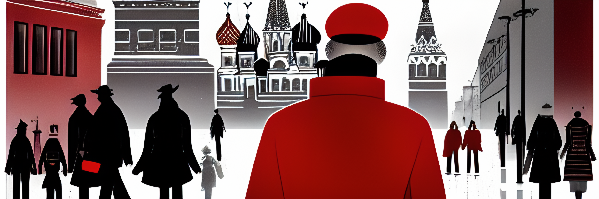

# Woland-10

Parallel corpora of Bulgakov's **The Master and Margarita**.

Image by SD. _view of moscow in fifties, Master and Margarita, professional illustrator, by rutkowski, trending on artstation, man in red coat and black hat goes on the street, mysterious, intricate details._

## About

This repo contains aligned corpus of 10 editions of MaM novel in different languages.

It was created with Lingtrain Alignment Studio which is an open-sourced tool fow aligning parallel corporas and creating multilingual books. Feel free to join us and the project.

## Languages

There are 5 languages by now.
